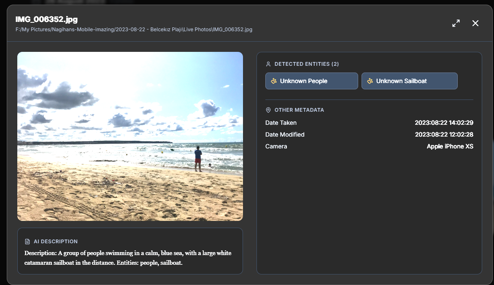
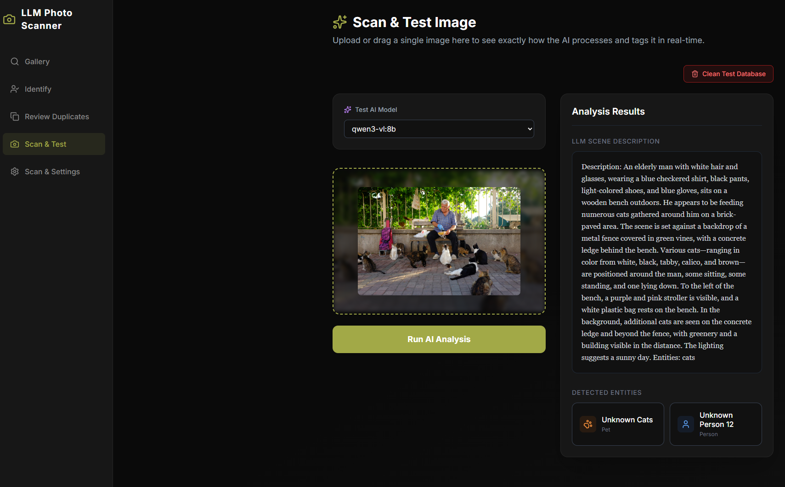
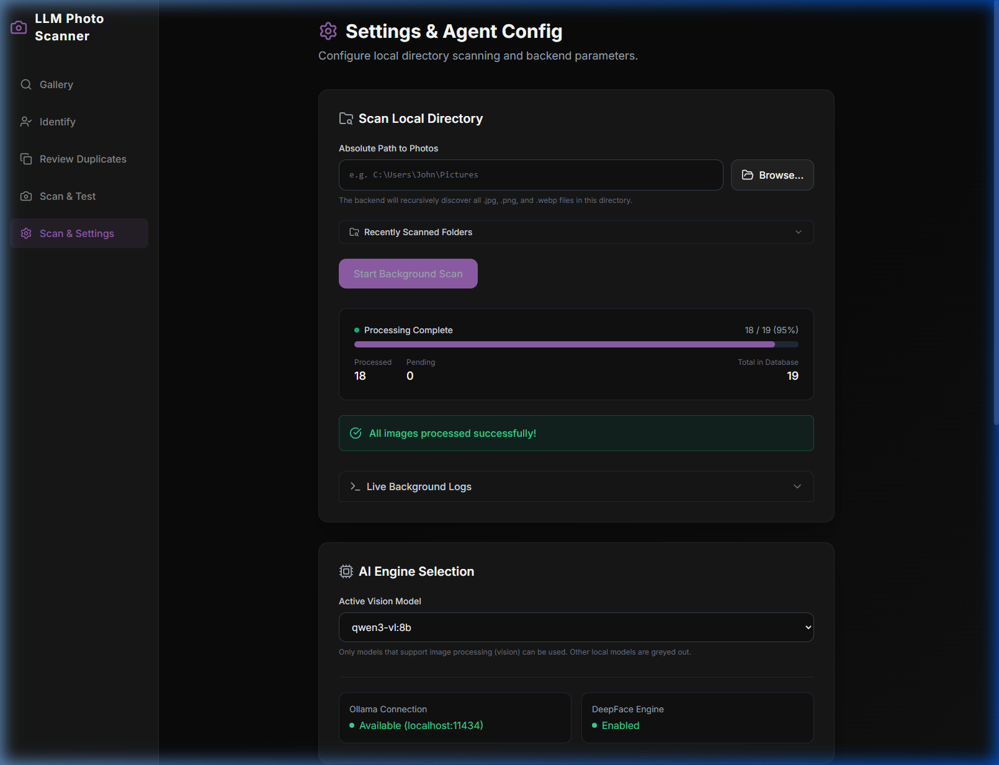
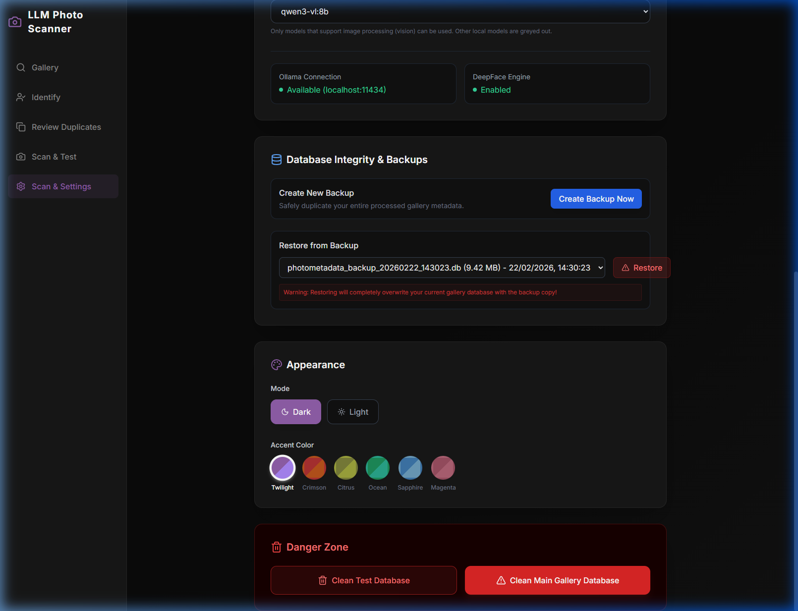

# Local LLM Photo Scanner v1.4
Local LLM Photo Scanner is a self-contained, privacy-preserving application that allows you to manage, search, and collate metadata for your personal photo collections entirely on your local machine.

The application intelligently scans your local directories, processing images using a locally-hosted Large Language Model (LLM) to generate rich, natural-language scene descriptions. It also leverages DeepFace facial recognition to detect and group unknown people and pets within your images, allowing you to seamlessly search your gallery using intuitive, natural language queries.

## Features

- **Privacy-First Processing**: All photo scanning, metadata generation, and facial recognition occur entirely on your local machine. No data is sent to the cloud.
- **Natural Language Search**: Quickly find images by searching for descriptions like "a dog in a park" or "a person wearing a red shirt".
- **Facial & Entity Clustering**: Identifies and clusters faces across your dataset, allowing you to attach real names to recognized individuals and pets. Entities can be renamed or deleted inline from the Gallery popup and the Scan & Test panel.
- **Duplicate & Screenshot Filter**: Native pre-processing hashes your images to automatically quarantine identical files and screenshots from your main, pristine gallery. Inspect and manage duplicates separately in the **Review Duplicates** tab.
- **Multi-Model AI Tracking**: Each photo records which Ollama vision model generated its description. You can switch the active model at any time and re-scan directories.
- **AI Model Comparison (Scan & Test)**: Upload a single photo directly and test it against any available vision model. Scan the same image with different models side-by-side to compare quality and accuracy.
- **Force Rescan**: Rescan a previously scanned directory to refresh AI descriptions and face data. A confirmation dialog warns you before overwriting existing metadata.
- **Background Scan Controls**: Pause, resume, or cancel any in-progress background scan without losing already-processed results. Live log output streams in-app so you can see exactly what the AI is processing.
- **Scan History Engine**: Previously scanned directories are listed for quick re-selection, showing the last scanned date.
- **Gallery Sorting & Timeline**: Sort photos by Date Taken, Date Created, Date Modified, or Filename (ascending or descending). A vertical year timeline on the right side of the gallery lets you jump instantly to any year.
- **Gallery Filters**: Filter photos by entity name, entity type (person / pet), camera model, faces-only, or unidentified faces.
- **Database Backup & Restore**: Create timestamped backups of your main gallery database from the Settings page and restore to any version with one click.
- **Safe Database Management**: The advanced settings panel lets you wipe the Sandbox Test DB or the Main Gallery DB with multi-step confirmation protection.
- **Custom Themes & Appearance**: Choose from 6 built-in colour themes (Twilight Purple, Crimson Sun, Citrus Olive, Ocean Mint, Sapphire Blue, Magenta Rose) plus a Light / Dark mode toggle — all from the Settings page. Preferences are saved automatically and applied instantly on next load with no flash.
- **FastAPI Backend**: A performant Python/FastAPI backend handling SQLite storage, background asynchronous image processing, and secure file serving.
- **In-App Notifications**: All action feedback (backup created, restore complete, entity errors) uses styled in-app toast notifications — no more browser alert pop-ups.

---

## Screenshots

| Gallery & Timeline                                                                                                   | Single Image Testing & QA                                                                              |
| -------------------------------------------------------------------------------------------------------------------- | ------------------------------------------------------------------------------------------------------ |
|                      |                    |
| **Scan & Settings**                                                                                                  | **Database, Themes & Danger Zone**                                                                     |
|  |  |

---

## Prerequisites

Before running the application, ensure you have the following installed on your system (compatible with Windows 11 and Ubuntu/Linux):

1.  **Python 3.10+**: Required for the FastAPI backend and AI processing libraries.
2.  **Node.js (v20+) & npm**: Required to run the Vite/React frontend.
3.  **Ollama**: Install [Ollama](https://ollama.com/) to run the local vision LLM.
4.  **Ollama Vision Model**: You must pull a vision-capable model. Recommend using `qwen3-vl:8b` or `llama3.2-vision:latest` or `llava:13b`.
    ```bash
    ollama run qwen3-vl:8b
    ```

---

## How to Build & Setup

### 1. Backend Setup

Open a terminal and navigate to the `backend` directory:

```bash
cd backend
```

Create a virtual environment and activate it:

**On Windows:**
```powershell
python -m venv venv
.\venv\Scripts\Activate.ps1
```

**On Linux/macOS:**
```bash
python -m venv venv
source venv/bin/activate
```

Install the required Python dependencies:
```bash
pip install -r requirements.txt
```

### 2. Frontend Setup

Open a new terminal and navigate to the `frontend` directory:

```bash
cd frontend
```

Install the required Node.js dependencies:
```bash
npm install
```

---

## How to Run

To use the application, you need to run both the FastAPI backend and the React frontend simultaneously, while ensuring Ollama is running in the background.

### 1. Ensure Ollama is Running
Make sure the Ollama service is active. By default, it runs on `http://localhost:11434`.

### 2. Start using provided scripts (Recommended)

You can easily start both the backend and frontend components together from the root directory. The scripts automatically stop any existing services on ports 8000 and 5173 before starting fresh.

**On Windows:**
Double click `start.bat` in the file explorer, or run it from the terminal:
```cmd
.\start.bat
```

**On Linux/macOS:**
Make the script executable (only needed once) and run it:
```bash
chmod +x start.sh
./start.sh
```

### 3. How to Stop

To stop both the backend and frontend services:

**On Windows:**
```cmd
.\stop.bat
```

**On Linux/macOS:**
```bash
./stop.sh
```

### 4. Start Manually (Alternative)

If you prefer to start them separately:

**Start the Backend**
In your backend terminal (with your virtual environment activated):

```bash
cd backend
uvicorn photo_backend:app --host 0.0.0.0 --port 8000
```

**Start the Frontend**
In your frontend terminal:

```bash
cd frontend
npm run dev
```

### 4. Open the Application
Navigate to the URL provided by Vite in your web browser (typically `http://localhost:5173`). 

Go to the **Scan & Settings** tab, input the absolute path to a folder containing images (e.g., `C:\Users\YourName\Pictures`), and start the background scan to watch the AI build your personalized photo dataset!

### 5. Managing Your Database

If you need to restart from scratch or clear out test scans:
- **From the UI**: Navigate to the **Scan & Settings** or **Scan & Test** tab. Scroll down to Database Management. You can securely wipe the test sandbox or the entire primary gallery DB using the protected UI buttons.
- **Database Backups**: Use the **Database Integrity & Backups** section in Settings to create a timestamped backup or restore from a previous backup.
- **From the Backend CLI**: You can run the `clean_db.py` script manually inside the `backend` environment:
  ```bash
  cd backend
  python clean_db.py --main
  # or
  python clean_db.py --test
  ```

### 6. Generate Python Documentation (PyDocs)

If you are a developer looking to extend the Python backend, you can automatically generate interactive API and module HTML documentation. Run the script provided in the root directory:

**On Windows:**
```cmd
.\backend\venv\Scripts\python.exe generate_pydocs.py
```
**On Linux/macOS:**
```bash
./backend/venv/bin/python generate_pydocs.py
```
This will create a `docs` folder globally, and deposit the newly generated HTML schema inside!

### 7. Running Backend Tests

The backend is fully tested using `pytest` with a suite of unit and integration tests covering the REST API, background worker, database setup, and mock AI interactions.

**Using the test runner script (Recommended):**

**On Windows:**
```cmd
.\run_tests_backend.bat
```

**On Linux/macOS:**
```bash
chmod +x run_tests_backend.sh
./run_tests_backend.sh
```

The script will automatically create a virtual environment and install dependencies if they don't exist. You can pass additional pytest arguments, e.g.:
```cmd
.\run_tests_backend.bat -k test_search
```

**Running manually:**

1. Ensure your virtual environment is activated in the `backend` folder.
2. Run the full test suite with coverage reporting:

   **On Windows:**
   ```powershell
   cd backend
   .\venv\Scripts\pytest -v --cov=.
   ```

   **On Linux/macOS:**
   ```bash
   cd backend
   ./venv/bin/pytest -v --cov=.
   ```

This will execute the isolated test database and output the coverage metrics (currently targeted at >80%). You can also generate an HTML coverage report by appending `--cov-report=html` to the commands above.

### 8. Running Frontend Tests

The frontend has a comprehensive test suite built with **Vitest**, **React Testing Library**, and **MSW** (Mock Service Worker). Tests cover all major components: Gallery, Settings, Identify, Duplicates, and the App shell.

**Using the test runner script (Recommended):**

**On Windows:**
```cmd
.\run_tests_frontend.bat
```

**On Linux/macOS:**
```bash
chmod +x run_tests_frontend.sh
./run_tests_frontend.sh
```

The script will automatically install `node_modules` if they don't exist. You can pass additional vitest arguments, e.g.:
```cmd
.\run_tests_frontend.bat --coverage
```

**Running manually:**

```bash
cd frontend
npm test          # interactive watch mode
npm run test:run  # single run (CI mode)
```

---

MIT

Built by **Ejber Ozkan** using **Gemini Antigravity** and these skills
```
python-design-patterns .\.agents\skills\python-design-patterns
  Agents: Antigravity, Gemini CLI
python-performance-optimization .\.agents\skills\python-performance-optimization
  Agents: Antigravity, Gemini CLI
vercel-react-best-practices .\.agents\skills\vercel-react-best-practices
  Agents: Antigravity, Gemini CLI
```
