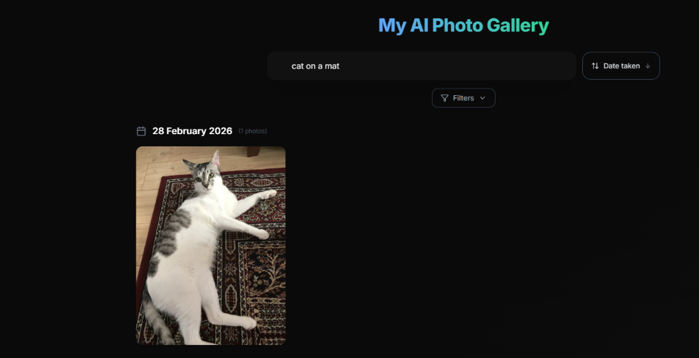
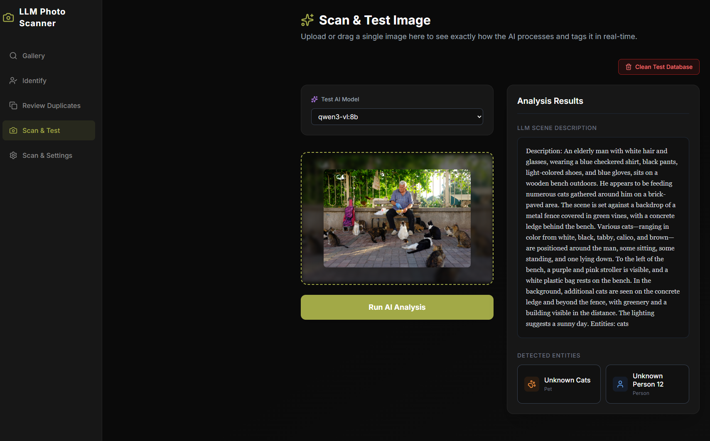
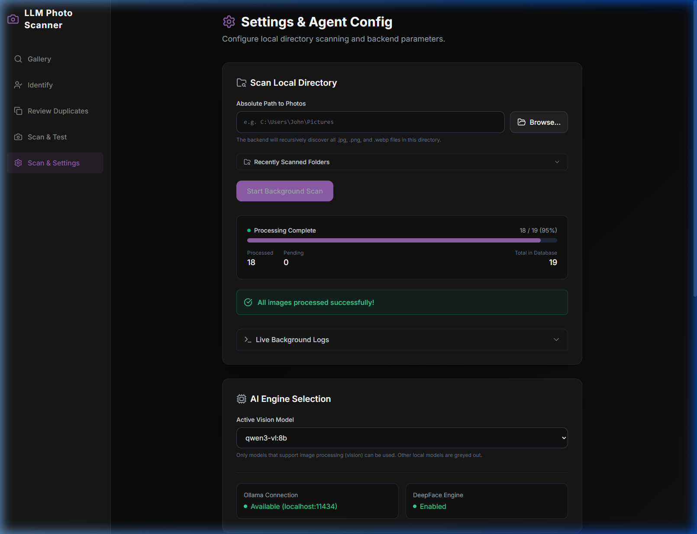
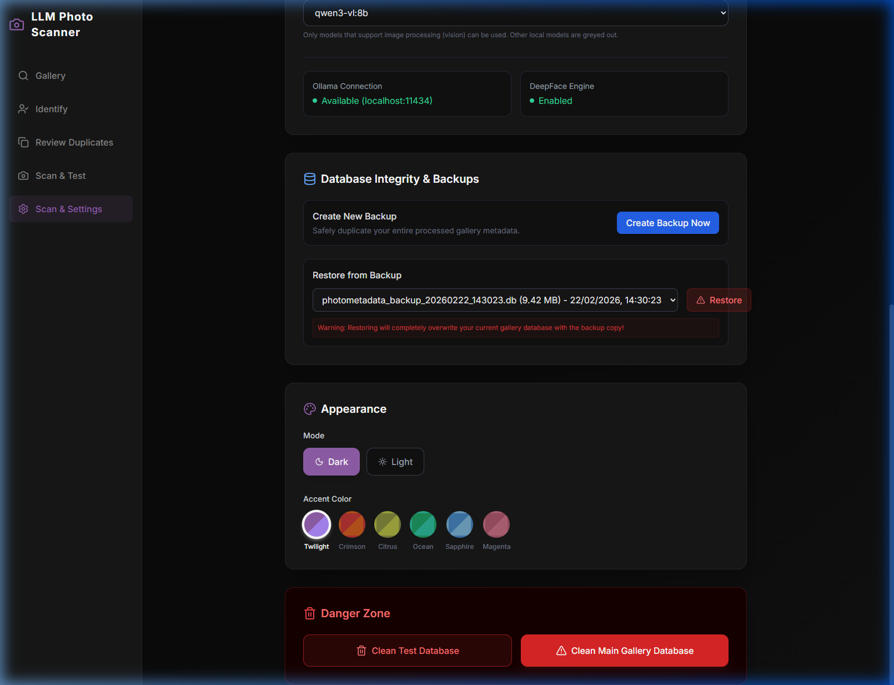
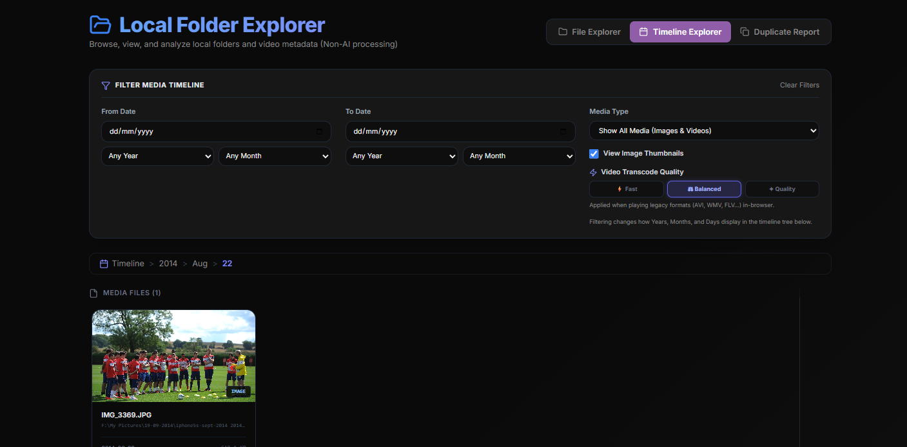
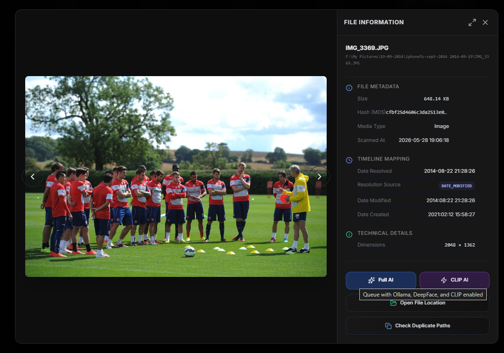
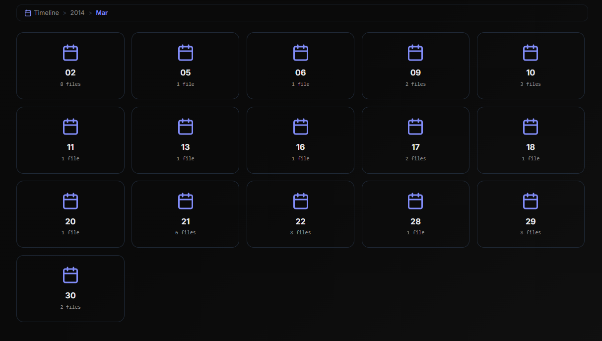

# Local AI Photo Gallery v3.6.1
Local LLM Photo Scanner is a self-contained, privacy-preserving application that allows you to manage, search, and collate metadata for your personal photo collections entirely on your local machine.

The application intelligently scans your local directories, processing images using a locally-hosted Large Language Model (LLM) to generate rich, natural-language scene descriptions. It also leverages DeepFace facial recognition to detect and group unknown people and pets within your images, allowing you to seamlessly search your gallery using intuitive, natural language queries.

## Features

### v3.6.1 Features
- **Ollama Scan Warm-Up**: AI scans now preload the selected Ollama vision model before processing the first image and pause safely if the model cannot be loaded.
- **Ollama Keep-Alive Controls**: Backend Ollama requests include a configurable keep-alive value so large vision models are less likely to unload mid-scan.
- **Ollama Setup Guidance**: README setup notes now include model preload and keep-alive options for long-running local scans.

### v3.5.0 Features
- **Durable Scan Sessions**: Pause and resume both AI and non-AI folder scans, including after closing and restarting the frontend/backend.
- **Local Folder Explorer AI Actions**: Send a viewed folder image directly to Full AI or CLIP AI processing from the file information panel without leaving the current view.
- **Live AI Queue Progress**: Folder image AI actions show an in-app progress popup that follows CLIP, DeepFace, and queue-completion log updates before fading away.
- **Folder Image Preview Upgrades**: Open full-size images from the file information panel, and preview HEIC/HEIF files through in-memory conversion without creating local sidecar files.
- **Bounded Video Validation**: Video probing now times out cleanly on bad or incomplete files so folder scans keep moving past broken media.

### Earlier Features
- **Local Folder Explorer**: Scan image and video libraries without AI processing, then browse indexed files by folder or timeline while retaining each real file path in the library.
- **Reliable Duplicate Review**: Export exact-hash duplicate reports to CSV, display clickable duplicate-count badges on media cards, and keep ordinary timeline totals focused on genuine media files.
- **Invalid Video Stub Detection**: Videos without a decodable media stream are classified as invalid media stubs and surfaced through a separate timeline/report category instead of being treated as ordinary duplicates.
- **Video Playback & Transcoding**: Preview supported video files in-app and optionally use FFmpeg to transcode legacy formats for browser playback.
- **CLIP Visual Search Engine**: Harness the power of OpenAI's CLIP model (via `sentence-transformers`) for instantaneous, text-to-image semantic search. The backend converts images directly into 512-dimensional vector math without requiring text descriptions, allowing you to seamlessly find what you're looking for with pinpoint precision.
- **Hybrid Semantic & Keyword Search**: Combines ChromaDB semantic vector matching with precise text keyword searches to ensure named entities and visual elements are both found in a single query.
- **Find Visually Similar Photos**: Instantly discover photos physically or contextually resembling each other using spatial coordinate matching via the CLIP engine—without relying on text interpretation.
- **Advanced Database Management**: Create timestamped backups of your main gallery database from the Settings page and restore to any version with one click. Securely wipe the test sandbox or the entire primary gallery DB using protected UI buttons.
- **Custom Themes & Appearance**: Choose from 6 built-in colour themes (Twilight Purple, Crimson Sun, Citrus Olive, Ocean Mint, Sapphire Blue, Magenta Rose) plus a Light / Dark mode toggle. Preferences are saved automatically and applied instantly on next load with no flash.
- **Multi-Model AI Tracking & Comparison**: Each photo records which Ollama vision model generated its description. You can switch the active model at any time. Upload a single photo directly in the "Scan & Test" tab to compare output from different models side-by-side.
- **Frontend Performance Optimizations**: Component decomposition, `useMemo`/`useCallback` hooks, code-splitting with `React.lazy`/`Suspense`, and `ErrorBoundary` implementations for a highly responsive and robust UI structure.
- **In-App Notifications**: All action feedback (backup created, restore complete, entity errors) uses styled in-app toast notifications — no more browser alert pop-ups.
- **Interactive Timeline & Detailed Sorting**: Sort photos by Date Taken, Date Created, Date Modified, or Filename. A vertical year timeline on the right side of the gallery lets you jump instantly to any year.
- **Privacy-First Processing**: All photo scanning, metadata generation, and facial recognition occur entirely on your local machine. No data is sent to the cloud.
- **Natural Language Search**: Quickly find images by searching for descriptions like "a dog in a park".
- **Facial & Entity Clustering**: Identifies and clusters faces across your dataset, allowing you to attach real names to recognized individuals and pets. Entities can be renamed or deleted inline from the Gallery popup and the Scan & Test panel.
- **Duplicate & Screenshot Filter**: Native pre-processing hashes your images to automatically quarantine identical files and screenshots from your main, pristine gallery. Inspect and manage duplicates separately in the **Review Duplicates** tab.
- **Force Rescan**: Rescan a previously scanned directory to refresh AI descriptions and face data. A confirmation dialog warns you before overwriting existing metadata.
- **Background Scan Controls**: Pause, resume, or cancel any in-progress background scan without losing already-processed results. Live log output streams in-app so you can see exactly what the AI is processing.
- **Scan History Engine**: Previously scanned directories are listed for quick re-selection, showing the last scanned date.
- **Gallery Filters**: Filter photos by entity name, entity type (person / pet), camera model, faces-only, or unidentified faces.
- **FastAPI Backend**: A performant Python/FastAPI backend handling SQLite storage, background asynchronous image processing, and secure file serving.

---

## Screenshots

| Gallery & Visual Search                                                                                              | Single Image Testing & QA                                                                              |
| -------------------------------------------------------------------------------------------------------------------- | ------------------------------------------------------------------------------------------------------ |
|                    |                    |
| **Scan & Settings**                                                                                                  | **Database, Themes & Danger Zone**                                                                     |
|  |  |

| Local Folder Timeline Filters                                                                                      | Folder File Information & AI Actions                                                                                     |
| ------------------------------------------------------------------------------------------------------------------ | ------------------------------------------------------------------------------------------------------------------------ |
|                            |                              |
| **Timeline Day Drilldown**                                                                                         |                                                                                                                          |
|                         |                                                                                                                          |

---

## Technology Architecture & Stack

### Frontend Stack
*   **React 18**: The core UI library used for building interactive interfaces.
*   **Vite**: An ultra-fast build tool and development server.
*   **TypeScript**: Provides static typing for safer, more robust code across all components and API schemas.
*   **Tailwind CSS**: Used extensively for rapid, utility-first styling and managing the app's diverse localized theme palette.
*   **Axios**: For managing all asynchronous REST requests to the Python backend.
*   **Frontend Testing**: 
    *   **Vitest**: A blazing fast unit test framework powered by Vite.
    *   **React Testing Library (RTL)**: Used to test the React components in a user-centric way.
    *   **MSW (Mock Service Worker)**: Mocks backend API network calls to test frontend isolation cleanly.

### Backend Stack
*   **Python 3.10+**: The language powering all API, database, and background tasks.
*   **FastAPI**: A modern, exceedingly fast web framework for building APIs with Python and automatic interactive validation (Swagger UI/Pydantic schemas).
*   **SQLite3**: Used broadly as a scalable, file-based relational database for storing standardized image metadata, configurations, and AI-generated textual descriptions.
*   **ChromaDB**: An open-source vector database specifically used to store, query, and threshold our 512-dimensional CLIP visual embeddings for semantic image-to-image math.
*   **Sentence-Transformers (OpenAI CLIP)**: Direct integration of `clip-ViT-B-32` into memory to translate image pixels seamlessly into queryable geometric spaces without textual intermediaries.
*   **DeepFace**: Manages facial extraction, clustering, and identification (facial embeddings) to consistently tag entities across disparate pictures.
*   **Pillow (PIL)**: Used securely to process, resize, extract Exif configurations, and stream bytes out to the interface.
*   **Backend Testing**:
    *   **Pytest**: Robust, fully-featured python testing framework for orchestrating endpoints and testing core state manipulation.
    *   **Pytest-Cov**: Used closely with Pytest to ensure we maintain our target of >80% test coverage across routing modules and workers.
    *   **Pytest-Asyncio**: Validates asynchronous concurrent network operations properly map responses.
*   **FFmpeg** *(optional)*: System-level binary used for real-time server-side video transcoding. Streams legacy formats (AVI, WMV, FLV, 3GP, MPG, DivX, RealMedia, etc.) as fragmented MP4 directly to the browser via a FastAPI `StreamingResponse` with no intermediate disk writes. Controlled by a Fast / Balanced / Quality preset toggle in the UI.

### Local AI Integrations
*   **Ollama**: A lightweight local LLM runner processing raw images through models like `qwen3-vl` or `llama3.2-vision` to write rich, descriptive text about standard photographs in the background.

---

## Prerequisites

Before running the application, ensure you have the following installed on your system (compatible with Windows 11 and Ubuntu/Linux):

1.  **Python 3.10+**: Required for the FastAPI backend and AI processing libraries.
2.  **Node.js (v20+) & npm**: Required to run the Vite/React frontend.
3.  **Ollama**: Install [Ollama](https://ollama.com/) to run the local vision LLM.
4.  **Ollama Vision Model**: You must pull a vision-capable model. Recommend using `qwen3-vl:8b` or `llama3.2-vision:latest` or `llava:13b`.
    ```bash
    ollama run qwen3-vl:8b
    ```
5.  **FFmpeg** *(Optional — required for in-browser playback of legacy video formats)*:
    Install [FFmpeg](https://ffmpeg.org/download.html) and ensure the `ffmpeg` binary is on your system `PATH`.
    Without it, files like `.avi`, `.wmv`, `.flv` will show an "Open in System Player" button instead of playing in-browser.

    | Platform | Install Command |
    |---|---|
    | **Windows** | Download from [gyan.dev/ffmpeg/builds](https://www.gyan.dev/ffmpeg/builds/), extract, add the `bin/` folder to your `PATH` |
    | **Linux (Ubuntu/Debian)** | `sudo apt install ffmpeg` |
    | **Linux (Fedora/RHEL)** | `sudo dnf install ffmpeg` |
    | **macOS** | `brew install ffmpeg` |

    Verify it is working: `ffmpeg -version`

---

## How to Build & Setup

### 1. Backend Setup

Open a terminal and navigate to the `backend` directory:

```bash
cd backend
```

Create a virtual environment and activate it:

**On Windows:**
```powershell
python -m venv venv
.\venv\Scripts\Activate.ps1
```

**On Linux/macOS:**
```bash
python -m venv venv
source venv/bin/activate
```

Install the required Python dependencies:
```bash
pip install -r requirements.txt
```

### 2. Frontend Setup

Open a new terminal and navigate to the `frontend` directory:

```bash
cd frontend
```

Install the required Node.js dependencies:
```bash
npm install
```

---

## How to Run

To use the application, you need to run both the FastAPI backend and the React frontend simultaneously, while ensuring Ollama is running in the background.

### 1. Ensure Ollama is Running
Make sure the Ollama service is active. By default, it runs on `http://localhost:11434`.

For AI scans, the backend now sends a preload request before processing the first image. By default, Ollama keeps a model loaded for only a short idle period, so this app also sends `keep_alive` with every Ollama request.

Recommended app settings for long scans:

**Windows PowerShell:**
```powershell
$env:OLLAMA_HOST = "127.0.0.1"
$env:OLLAMA_PORT = "11434"
$env:OLLAMA_KEEP_ALIVE = "30m"
$env:OLLAMA_PRELOAD_TIMEOUT = "180"
```

**Linux/macOS:**
```bash
export OLLAMA_HOST=127.0.0.1
export OLLAMA_PORT=11434
export OLLAMA_KEEP_ALIVE=30m
export OLLAMA_PRELOAD_TIMEOUT=180
```

Set `OLLAMA_KEEP_ALIVE` to a longer value such as `24h` for all-day scans, or `-1` if you want Ollama to keep the model loaded until you stop it manually. This uses more VRAM/RAM, but avoids the cold-start delay and reduces first-image failures on large vision models.

You can also manually preload the default vision model before starting a scan:

**Windows PowerShell:**
```powershell
Invoke-RestMethod `
  -Uri "http://127.0.0.1:11434/api/generate" `
  -Method Post `
  -ContentType "application/json" `
  -Body '{"model":"llama3.2-vision:latest","prompt":"","stream":false,"keep_alive":"30m"}'
```

**Linux/macOS:**
```bash
curl http://127.0.0.1:11434/api/generate \
  -d '{"model":"llama3.2-vision:latest","prompt":"","stream":false,"keep_alive":"30m"}'
```

To confirm what Ollama has loaded:

```bash
ollama ps
```

To unload a model manually:

```bash
ollama stop llama3.2-vision:latest
```

### 2. Start using provided scripts (Recommended)

You can easily start both the backend and frontend components together from the root directory. The scripts automatically stop any existing services on ports 8000 and 5173 before starting fresh.

**On Windows:**
Double click `start.bat` in the file explorer, or run it from the terminal:
```cmd
.\start.bat
```

**On Linux/macOS:**
Make the script executable (only needed once) and run it:
```bash
chmod +x start.sh
./start.sh
```

### 3. How to Stop

To stop both the backend and frontend services:

**On Windows:**
```cmd
.\stop.bat
```

**On Linux/macOS:**
```bash
./stop.sh
```

### 4. Start Manually (Alternative)

If you prefer to start them separately:

**Start the Backend**
In your backend terminal (with your virtual environment activated):

```bash
cd backend
uvicorn photo_backend:app --host 0.0.0.0 --port 8000
```

**Start the Frontend**
In your frontend terminal:

```bash
cd frontend
npm run dev
```

### 4. Open the Application
Navigate to the URL provided by Vite in your web browser (typically `http://localhost:5173`). 

Go to the **Scan & Settings** tab, input the absolute path to a folder containing images (e.g., `C:\Users\YourName\Pictures`), and start the background scan to watch the AI build your personalized photo dataset!

### 5. Managing Your Database

If you need to restart from scratch or clear out test scans:
- **From the UI**: Navigate to the **Scan & Settings** or **Scan & Test** tab. Scroll down to Database Management. You can securely wipe the test sandbox or the entire primary gallery DB using the protected UI buttons.
- **Database Backups**: Use the **Database Integrity & Backups** section in Settings to create a timestamped backup or restore from a previous backup.
- **From the Backend CLI**: You can run the `clean_db.py` script manually inside the `backend` environment:
  ```bash
  cd backend
  python clean_db.py --main
  # or
  python clean_db.py --test
  ```

### 6. Generate Python Documentation (PyDocs)

If you are a developer looking to extend the Python backend, you can automatically generate interactive API and module HTML documentation. Run the script provided in the root directory:

**On Windows:**
```cmd
.\backend\venv\Scripts\python.exe generate_pydocs.py
```
**On Linux/macOS:**
```bash
./backend/venv/bin/python generate_pydocs.py
```
This will create a `docs` folder globally, and deposit the newly generated HTML schema inside!

### 7. Running Backend Tests

The backend is fully tested using `pytest` with a suite of unit and integration tests covering the REST API, background worker, database setup, and mock AI interactions.

**Using the test runner script (Recommended):**

**On Windows:**
```cmd
.\run_tests_backend.bat
```

**On Linux/macOS:**
```bash
chmod +x run_tests_backend.sh
./run_tests_backend.sh
```

The script will automatically create a virtual environment and install dependencies if they don't exist. You can pass additional pytest arguments, e.g.:
```cmd
.\run_tests_backend.bat -k test_search
```

**Running manually:**

1. Ensure your virtual environment is activated in the `backend` folder.
2. Run the full test suite with coverage reporting:

   **On Windows:**
   ```powershell
   cd backend
   .\venv\Scripts\pytest -v --cov=.
   ```

   **On Linux/macOS:**
   ```bash
   cd backend
   ./venv/bin/pytest -v --cov=.
   ```

This will execute the isolated test database and output the coverage metrics (currently targeted at >80%). You can also generate an HTML coverage report by appending `--cov-report=html` to the commands above.

### 8. Running Frontend Tests

The frontend has a comprehensive test suite built with **Vitest**, **React Testing Library**, and **MSW** (Mock Service Worker). Tests cover all major components: Gallery, Settings, Identify, Duplicates, and the App shell.

**Using the test runner script (Recommended):**

**On Windows:**
```cmd
.\run_tests_frontend.bat
```

**On Linux/macOS:**
```bash
chmod +x run_tests_frontend.sh
./run_tests_frontend.sh
```

The script will automatically install `node_modules` if they don't exist. You can pass additional vitest arguments, e.g.:
```cmd
.\run_tests_frontend.bat --coverage
```

**Running manually:**

```bash
cd frontend
npm test          # interactive watch mode
npm run test:run  # single run (CI mode)
```

### 9. Versioning

The repository version is sourced from the root [`VERSION`](VERSION) file.

- Runtime and shell scripts read directly from `VERSION`.
- Frontend package metadata, README headings, and version test mocks are updated via the release helper:

```bash
python scripts/bump_version.py 3.0.0
```

You can also verify everything is aligned without changing files:

```bash
python scripts/bump_version.py --check
```

---

MIT

Built by **Ejber Ozkan** using **Gemini Antigravity** and these skills
```
python-design-patterns .\.agents\skills\python-design-patterns
  Agents: Antigravity, Gemini CLI
python-performance-optimization .\.agents\skills\python-performance-optimization
  Agents: Antigravity, Gemini CLI
vercel-react-best-practices .\.agents\skills\vercel-react-best-practices
  Agents: Antigravity, Gemini CLI
```
