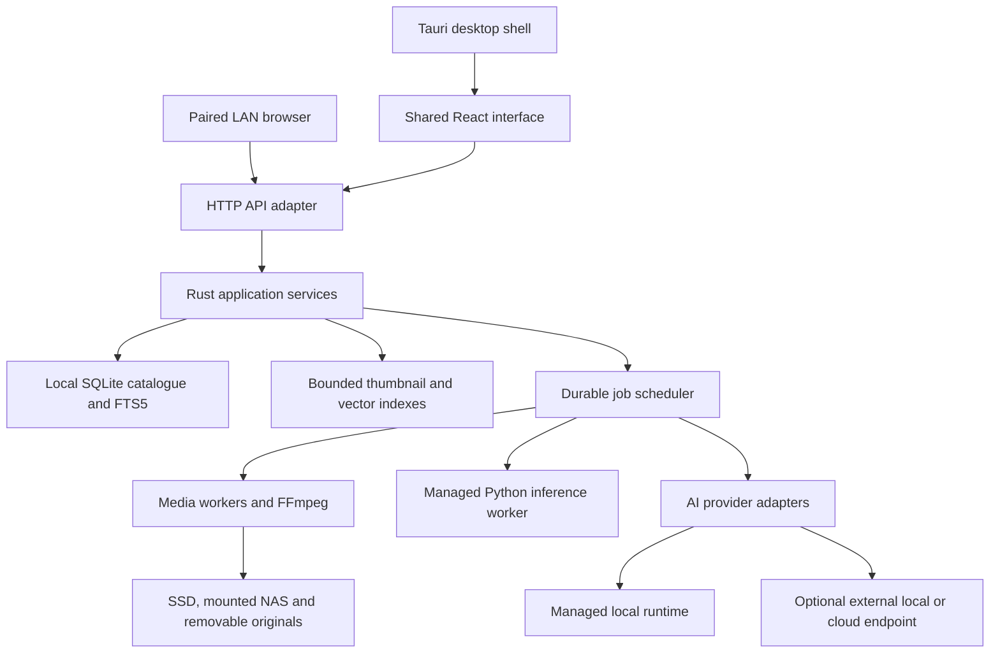

# Proposed architecture

## Components and ownership

Choose a modular application with a few owned processes. The Rust engine is
independent of the shell; React is shared by desktop and paired LAN browsers.
Tauri is selected provisionally, subject to the platform proof in the plan.

Proposed workspace boundaries: existing `frontend/` becomes the shared UI;
`src-tauri/` owns shell integration; `crates/catalog-core/` owns application
services; `crates/catalog-http/` owns transport; `workers/inference/` owns reused
Python AI; `contracts/` holds versioned request/event schemas; `tests/fixtures/`
holds small deterministic fixtures. These directories are planned, not created.

Catalogue services expose typed use cases (search, seek date, enqueue scope,
rename entity, snapshot). UI components contain presentation and interaction;
they do not assemble SQL or provider-specific image requests. Constructor
injection and small interfaces isolate storage, clock, filesystem and inference.
Use composition and explicit state machines, avoiding generic plugin frameworks
or microservices. Batch and sandbox processing invoke the same pipeline.

## Desktop and LAN transport

The engine serves the built React assets and versioned HTTP API on an ephemeral
loopback listener. Tauri displays that local origin; it starts/stops only its
owned engine/helpers. No Vite server or system Python/Node installation ships.
Single-instance activation focuses the existing app. Health/readiness is explicit.

Use one generated TypeScript API client and shared domain contracts. The desktop
receives a short-lived bootstrap credential through its native bridge, exchanged
for a session; never embed credentials in URLs or logs. Validate Host/Origin,
restrict navigation/CSP, protect mutations against CSRF, and scope media access
to catalogue asset IDs. Prove bootstrap, media ranges and navigation in Phase 1.

Grant only narrowly scoped native commands to the exact selected engine origin,
never a wildcard `localhost:*` capability. Authenticate that engine instance and
invalidate bridge/session access on crash or restart; test another process taking
its old port. Remote-origin capability support must be proven against Tauri's
[capability rules](https://v2.tauri.app/security/capabilities/) in Phase 1. Do not
weaken origin checks just to make the prototype work.

LAN is off initially. When enabled, a separate listener uses TLS, explicit
device pairing approved on the desktop, revocable sessions and scoped roles.
Document local certificate trust setup; do not tell users to ignore certificate
errors. Viewing is the default role; scan/provider/library management needs a
granted role. Native picker/open/reveal commands remain desktop-local. A remote
browser chooses among authorised host roots, never arbitrary host paths.
Secrets remain in the host OS credential store. LAN clients never open SQLite.

Expose progress through reconnectable events with sequence IDs and coalescing;
clients recover from a status snapshot when an event gap occurs. Events reference
stable job/asset IDs rather than sending complete library arrays.

## Catalogue, dates and consistency

SQLite WAL + FTS5 is the authoritative local catalogue. Use one engine-owned
writer queue, short batched transactions, bounded read connections and explicit
schema migrations. Never put the active database on a network filesystem:
[SQLite documents WAL's same-host requirement](https://www.sqlite.org/wal.html).

Represent an asset separately from its file locations. Track root ID, relative
path, platform-aware identity, size/mtime, availability, content revision and
scan generation. Preserve Unicode and filesystem case semantics. Do not assume
POSIX ctime means creation time; retain date provenance and timezone/unknown-date
information. Content hashes establish exact duplicates; stat equality alone
does not. File IDs are hints, not portable permanent identities.

Filesystem created/modified dates and availability belong to locations; capture
date/EXIF and derived pixel content belong to assets, with explicit overrides.
Gallery defaults to one content asset, using a stable persisted representative
location for filesystem-date sorting; do not switch its date when a disk goes
offline. A root filter chooses a representative within that scope. Folder views
show locations. Counts/date rail always follow the view's entity and scope;
duplicate reports show every matching location. Preserve a show-copies option
and test identical content in two roots with different dates and availability.

Separate asset/location, metadata, person/pet/entity, observation, description,
job/stage, provider profile, model manifest, processing revision and index-update
records. Descriptions include provider/model/prompt versions. Index namespaces
include embedding model, dimension, normalization, metric and preprocessing.
Do not mix incompatible vectors or reuse a threshold across model changes.

Use composite indexes for root/date/status/entity queries and keyset pagination
with deterministic ID tie-breaks. Date seeks and viewport anchors operate on
query plus cursor, not numeric offsets into millions of rows. Base year/month/day
counts update transactionally; filtered histograms are cached by query/revision,
with explicit loading states for expensive combinations. Never derive date-rail
coverage from the current page. Semantic query sessions retain their bounded
ranked candidate set so dates/counts describe that result set honestly.

Maintain FTS rows in the same transaction as their source metadata; test changes
and deletes. FTS improves indexed word search but is not identical to arbitrary
substring matching. Preserve required filename/path substring behavior with a
tested trigram/appropriate index strategy. Define Unicode/tokenization semantics.
[FTS5 documentation](https://www.sqlite.org/fts5.html).

Vector indexes are derived data behind `VectorIndex`, with durable revisioned
embedding records and a transactional outbox. Upserts/deletes are idempotent;
lag is observable; restart replays unfinished updates. Human labels and
descriptions remain authoritative in SQLite. A crash must not lose their edits.

Evaluate USearch as the first embedded index candidate, against the current
Chroma behavior and exact-search ground truth. Its Rust support and disk-backed
views are useful, but do not prove cheap mutable indexing or bounded rebuild
memory. Benchmark increment/delete, filtered recall and compaction at 1M/5M.
Use bounded mutable segments and immutable snapshots only if the measurements
require them. Keep indexing off the UI thread and bound working sets. If the
candidate fails, record the replacement decision before the search phase.
[USearch capabilities](https://github.com/unum-cloud/USearch).

Hybrid search combines indexed text/filter results with vector candidates;
retain relevance scores and explicit sorting. Push filters into retrieval where
supported, adaptively retrieve more candidates otherwise, and test rare-filter
recall. A fixed global top-100 followed by filtering is not acceptable. Index
absence or model cold start must not block keyword search.

Duplicate CSV exports stream the complete filtered query in bounded batches.
Map queries aggregate by viewport/zoom and bound cluster expansion. Folder/date
leaves paginate, including a single day containing hundreds of thousands of
items. These routes must not materialise entire result collections in memory.

## Import, thumbnails and background work

Enumerate lazily and commit discovered batches immediately. Discovery does not
wait for hashing, full metadata, thumbnails, face recognition or descriptions.
Prioritise visible thumbnails and interactive queries above bulk imports and AI.
Jobs have per-source I/O limits, bounded queues and CPU/RAM/VRAM budgets. NAS
enumeration and unavailable devices use timeouts/backoff and do not block peers.

Follow directory symlinks only by explicit policy, detect cycles, handle nested
roots without duplicate work, and retain offline roots. Reconcile changes using
completed scan generations; filesystem watchers are hints plus periodic scans,
especially for NAS. A source disconnect transitions work to waiting-for-source.

Thumbnail cache keys contain asset content revision, size tier, orientation and
decoder version. Write atomically in a sharded cache, deduplicate requests, bound
decode memory, and evict by byte budget. Prioritise small previews, load originals
only on demand, stream hashes, and sandbox/time-limit corrupt media work. Use
FFmpeg for compatible fallback playback/transcode with cancellation, cleanup,
range/seek handling and bounded cache. Test HEIC and video codecs per package.

Stage states: pending, leased/running, succeeded, failed, paused, cancelled,
waiting-for-source. Leases expire after worker death. A result commits only when
asset revision and job generation still match. At-least-once execution plus
idempotent writes prevents duplicate labels/vectors. Cancellation bounds future
work; an uninterruptible provider call may finish but stale results are rejected.
Snapshot the chosen model/settings per job and retry only missing/failed stages.

Bulk scan scope means the full query/date scope, not just rendered thumbnails.
Persist the query, source scope and upper asset-ID cutoff, excluding later imports.
Enumerate candidates by bounded cursor; evaluate filters when each candidate is
enqueued, then freeze its job membership. The preview count is an estimate until
selection completes. Recheck content revision at execution; do not silently
include newly changed files. Test concurrent imports and scope dispatch.
Keep human label/correction overrides separate from recomputable model output.

## AI and reuse

Separate `InferenceProvider` (capabilities, image description, embeddings,
timeouts, streaming, error normalization) from `ManagedRuntime` (download,
validate, start, health, stop, unload). API compatibility does not imply model
management compatibility. Implement OpenAI-compatible image/chat and Ollama-native
adapters; discover/probe capabilities before enabling a stage.

The first managed vision-runtime candidate is a pinned llama.cpp server plus
compatible vision model/projector, verified on CPU and Apple Silicon before
adoption. Existing/user-installed Ollama and other local servers remain options.
Select a small default model using the quality/resource fixture, not popularity.
The runtime's [multimodal API](https://github.com/ggml-org/llama.cpp/blob/master/docs/multimodal.md)
and [Ollama compatibility scope](https://docs.ollama.com/api/openai-compatibility)
must be checked for the exact pinned versions.

Initially reuse CLIP/DeepFace behavior in a lazily started, isolated Python
worker with locked dependencies. Package it as an installed directory payload;
never load TensorFlow/PyTorch during catalogue startup. Workers return results
to the engine rather than writing the database. Separate wire protocol version
and bounded frames make failures/test fakes predictable. stdout is protocol only;
logs use stderr. Worker processes use validated asset IDs/authorised paths.

Evaluate ONNX conversions or alternative face/embedding models only with quality
equivalence tests and redistributed-model rights established. There is no
assumption that VGG-Face vectors are 512-dimensional. Reuse tested EXIF, Unicode,
date, media and pet-parsing behavior as reference fixtures when porting hot paths;
retain working Python adapters until native replacements prove parity.

Model/runtime downloads use versioned manifests, size/hash checks, resumable
temporary files and atomic activation. Enforce disk budgets and CPU fallback.
Do not auto-download all accelerators/models. Credentials never enter frontend
bundles, ordinary logs, exported reports or unencrypted backups.

Cloud processing is opt-in per job/provider. Show resized pixel/metadata payload
policy, destination, estimated cost when available, rate limits and retry budget.
Provider switches and remote redirects cannot silently change privacy boundaries.
Local-only jobs never fall back to a remote endpoint. NAS/LAN/model download/map
network use is described separately from third-party inference.

## Backup, updates and distribution

Use SQLite's [online backup API](https://www.sqlite.org/backup.html) for a coherent
catalogue snapshot; copy immutable referenced embedding segments at the same
generation or omit reconstructible indexes explicitly. Record schema version,
checksums and a manifest. Pause mutation, validate a restore in staging, close
handles, then atomically activate with a rollback copy. Never copy a live WAL
database as if the main `.db` file were a complete snapshot.

Build per OS/architecture, including Python/native dependencies. Tauri can bundle
[sidecars](https://v2.tauri.app/develop/sidecar/) and produce releases through its
[GitHub Actions workflow](https://v2.tauri.app/distribute/pipelines/github/).
[PyInstaller directory packaging](https://pyinstaller.org/en/stable/operating-mode.html)
avoids per-launch extraction. Model/runtime versions are independent of app
versions. Sign nested macOS helpers and notarize the final bundle; sign/timestamp
Windows packages. Validate dependency/model/FFmpeg notices for actual shipped builds.

RHEL 10 [removed WebKitGTK](https://docs.redhat.com/en/documentation/red_hat_enterprise_linux/10/html/10.0_release_notes/removed-features).
Prove the packaged-runtime Linux path before declaring Tauri final. Tauri's
[AppImage guide](https://v2.tauri.app/distribute/appimage/) also documents glibc
and multimedia constraints; changing extension does not solve compatibility.

Updater signatures are separate from OS signing. Use the Tauri updater only for
supported artifacts. For initial GitHub-only `.deb`/`.rpm` distribution, notify
users to download and reinstall the new package; no automatic APT/DNF repository
is implied. Flatpak requires a published update repository or the same explicit
manual-upgrade flow. Test the chosen installation/update route end to end.
Back up before schema upgrades; prevent launching older incompatible binaries
against a newer schema. A failed update must retain a usable previous installation
and a documented data-restore path. [Updater rules](https://v2.tauri.app/plugin/updater/).
